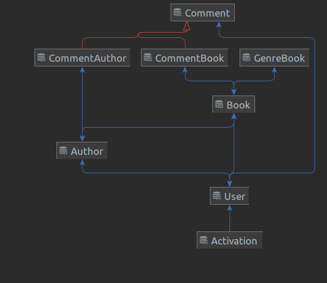
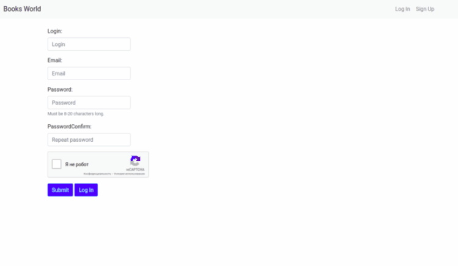

# Books World
Проект реализует функционал каталога книг. Ресурс поможет пользователю ознакомится с перечнем книг автора, почитать или оставить отзыв об авторе или книге, поставить оценку и лайк книге.
Также реализована сортировка книг по количеству лайков, фильтрация списка книг по жанру.
## Descriptions
Проект носит учебный характер с основной направленностью на BackEnd, 
поэтому дизайну и UI досталось минимальное количество времени.

Структура БД:

В проекте применена ReCaptcha от Google при регистрации пользователя.
После регистрации пользователя на введённый email посредством SMTP отсылается письмо с подтверждением.

Для пользователей реализованы следующие роли:
1. Admin - управление пользователями
2. Manager - управление книгами и авторами
3. User

Инструменты и технологии:
* SpringBoot - каркас нашего веб-приложения, который:
  * предоставляет доступ к различным модулям(Security, Data, MVC, ORM), 
  * конфигурирует beans для доступа к бд(dataSource, entityManager, transaction)
  * конфигурирует view resolver и дсипетчер ресурсов
  * позволяет определить главный класс, загружающий контекст приложения;
* Hibernate - основной способ доступа к БД, используется в основном посредством JpaRepositories c написанием запросов на JPQL;
* Freemarker - использовался как основной способ заполнения данными 
и формирования из шаблонов веб-ресурсов;
* Bootstrap - фреймворк для организации веб-страниц, 
определения стилей и дефолтного JavaScript для элементов веб-страниц.

## Feature scope
В дальнейшем планируется добавить функциональность интернет-магазина. 
Для этого необходимо описать сущности с информацией о конкретном экземпляре книги и издательстве
сущности для хранения информации о заказах и доставке.
Также добавить модули с корзиной.

## Setup
Вследствие учебного характера проекта, он не запущен на веб-сервере. 
Поэтому для его запуска необходимо создать БД переопределить application.properties.
Данный процесс маловероятен, поэтому прикладываю скрины работы приложения.

##Screen Shots
